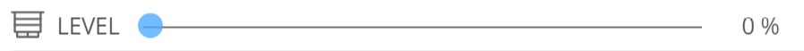
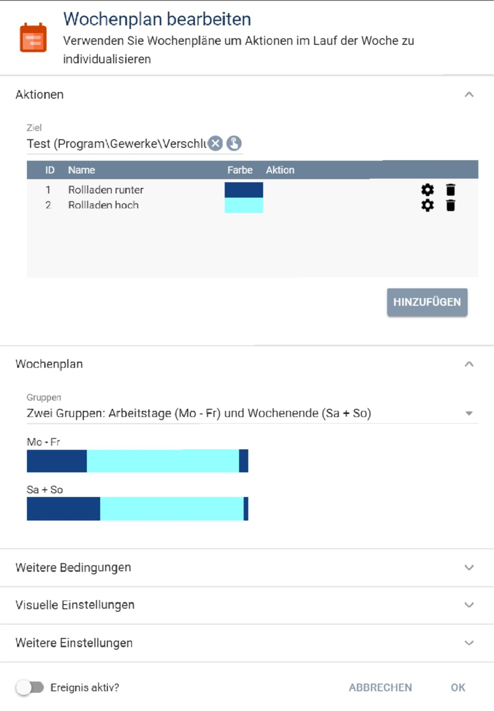
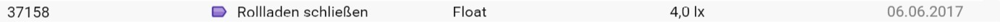

# Rolladensteuerung

Modul für IP-Symcon ab Version 5.1. Autor: Hagi

Steuert einen Rollladen, eine Markise oder eine ähnliche Abdunkelungseinrichtung nach konfigurierbaren Regeln.

## Inhaltsverzeichnis

1. [Funktionsumfang](#1-funktionsumfang)
2. [Voraussetzungen](#2-voraussetzungen)
3. [Installation](#3-installation)
4. [Funktionsreferenz](#4-funktionsreferenz)
5. [Konfiguration](#5-konfiguration)
6. [Statusvariablen](#6-statusvariablen)
7. [Prioritäten](#7-prioritäten)
8. [Anhang](#8-anhang)

---

## 1. Funktionsumfang

- Hoch-/Runterfahren zu vorgegebenen Zeiten (Wochenplan)
- Tagerkennung über IsDay-Variable oder Helligkeitsvergleich
- **Priorität:** Tagerkennung (Sonne/Helligkeit) hat Vorrang vor dem Wochenplan
- Urlaubs- und Feiertagsberücksichtigung
- Sonnenschutz inkl. Nachführen nach Sonnenstand (einfach und präzise Variante)
- Beschattung nach Helligkeit
- Kontakte zum Öffnen des Rollladens mit **Integer-Modus** (drei Zustände: geschlossen / gekippt / geöffnet)
- Kontakte zum Schließen des Rollladens
- **Balkontür-Modus:** Fenstergriff hat immer Vorrang vor Wochenplan und Beschattung
- **Lichtsteuerung** bei Kontaktzustandsänderung (Boolean, String oder Float-Variable schaltbar, optional mit Freigabe-Variable)
- Notfall-Kontakt (öffnet sofort, Automatik bleibt aktiv)
- Erkennung manueller Bedienung mit konfigurierbarer Sperrzeit
- Verzögerung bei Tag/Nacht-Wechsel (optional zufällig)
- Aktivierung/Deaktivierung über Statusvariable (nur durch Benutzer oder Boolean-Variable)
- Herstellerunabhängig (alle Aktoren mit Statusvariable + RequestAction)
- Gruppenmaster zur Verwaltung mehrerer Instanzen

---

## 2. Voraussetzungen

- IP-Symcon ab Version 5.1
- Aktor mit einer Statusvariable vom Typ Integer oder Float
- Die Statusvariable muss über `RequestAction` steuerbar sein (nicht emuliert)
- Geeignete Profildarstellung: „Legacy Profil" mit korrektem Min/Max oder „Rolladen"
- Bei Homematic (Minimalwert = geschlossen): Profil mit Endung `.Reversed` verwenden

---

## 3. Installation

### 3.1 Modul laden

Das Modul über die Modulverwaltung in IP-Symcon installieren (Bibliothek hinzufügen über die GUID `{153CE11A-48A3-48F4-A022-140A3F7509DB}`).

### 3.2 Rollladeninstanz anlegen

Im Objektbaum `Instanz hinzufügen` → `Rolladensteuerung` suchen. Pro Rollladen wird eine Instanz angelegt.

### 3.3 Gruppenmaster anlegen (optional)

Im Objektbaum `Instanz hinzufügen` → `Rolladensteuerung Gruppe` suchen. Der Gruppenmaster dient der gemeinsamen Verwaltung mehrerer Instanzen.

### 3.4 Rollladen prüfen

Vor der Konfiguration sicherstellen, dass der Rollladen korrekt in Symcon eingerichtet ist:
- Positionsvariable mit adaptivem Icon (z.B. „Jalousie") im Webfront prüfen
- Geöffnet und Geschlossen müssen korrekt dargestellt werden




Ist die Darstellung invertiert, dem Profil `.Reversed` anhängen.

---

## 4. Funktionsreferenz

```php
BLC_ControlBlind(int $InstanceID, bool $considerDeactivationTimes): bool
```
Führt einen vollständigen Steuerungslauf durch. `$considerDeactivationTimes = true` berücksichtigt die konfigurierte Sperrzeit nach automatischer Bewegung.

---

```php
BLC_MoveBlind(int $InstanceID, int $percentBlindClose, int $percentSlatsClose, int $deactivationTimeAuto, string $hint): bool
```
Fährt den Rollladen direkt auf eine Position.

| Parameter | Typ | Beschreibung |
|---|---|---|
| `$percentBlindClose` | int 0–100 | Schließungsgrad des Behangs (0 = offen, 100 = geschlossen) |
| `$percentSlatsClose` | int 0–100 oder -1 | Lamellenstellung; -1 = keine Lamellensteuerung |
| `$deactivationTimeAuto` | int | Sekunden seit letzter Automatikbewegung die mindestens vergangen sein müssen |
| `$hint` | string | Hinweistext für die Statusvariable LAST_MESSAGE |

---

```php
BLCGM_GetBlinds(int $InstanceID): array
```
Liefert alle im Gruppenmaster markierten Rollladeninstanzen.

```php
BLCGM_GetPropertyOfBlinds(int $InstanceID, string $Property): array
```
Liest eine Property von allen markierten Instanzen.

```php
BLCGM_SetPropertyOfBlinds(int $InstanceID, string $Property, mixed $Value): bool
```
Setzt eine Property bei allen markierten Instanzen.

```php
BLCGM_SetBlindsActive(int $InstanceID, bool $active): void
```
Aktiviert oder deaktiviert alle markierten Instanzen.

---

## 5. Konfiguration

### 5.1 Wochenplan

Für die Grundfahrzeiten ist ein Wochenplan-Ereignis in IP-Symcon anzulegen:



**Wichtig:**
- Genau zwei Aktionen mit IDs **1** (Tag / Rollladen auf) und **2** (Nacht / Rollladen zu) anlegen
- Die Aktionen selbst bleiben ohne Funktion (leerer PHP-Code)
- Maximal ein Zeitpunkt für Aktion 1 (Auffahrzeit) pro Gruppe
- IP-Symcon setzt zu Mitternacht automatisch einen Startzustand (Aktion 2) – das ist korrekt und kein Fehler

Der Wochenplan ist **Pflicht**. Soll ausschließlich Tagerkennung genutzt werden, genügt ein einfacher Wochenplan mit einer 24-Stunden-Zeitspanne für Aktion 2.

### 5.2 Tagerkennung (optional)

Ergänzend zum Wochenplan kann eine Tagerkennung konfiguriert werden. **Die Tagerkennung hat Vorrang vor dem Wochenplan** – ist kein Sensor konfiguriert, entscheidet allein der Wochenplan.

Zwei Möglichkeiten:
1. **IsDay-Variable** – z.B. vom Location-Modul
2. **Helligkeitsvergleich** – Helligkeitsvariable + Schwellwertvariable (optional mit Durchschnitt über n Minuten, erfordert Archivierung)



Übersteuernde feste Tagesstart-/Tagesendezeiten können zusätzlich als String-Variablen (Format `HH:MM`) angegeben werden.

### 5.3 Beschattung nach Sonnenstand (optional)

Benötigt: Azimuth-Variable und Altitude-Variable (z.B. vom Location-Modul), Azimuth-Bereich (von/bis).

Optional: Helligkeitssensor und Schwellwert (Beschattung nur bei ausreichender Helligkeit), Temperaturvariable (Hitzeschutz: bei >27 °C +15 %, bei >30 °C auf 90 % geschlossen).

**Zwei Berechnungsvarianten:**
- **Einfach** (nur Fassadenfenster): Zwei Behanghöhen bei zwei Sonnenhöhen angeben → lineare Interpolation
- **Präzise** (auch Dachfenster): Fensterausrichtung, Neigung, Höhe, Brüstungshöhe und maximale Eindringtiefe der Sonne angeben

### 5.4 Beschattung nach Helligkeit (optional)

Bis zu zwei Helligkeitsschwellwerte mit je einer Rollladenposition. Bei Überschreitung wird der Rollladen auf die zugehörige Position gefahren. Steuerbar über eine Aktivierungsvariable.

Wenn beide Beschattungsarten aktiv sind, gilt der restriktivere Wert (weiter geschlossen).

### 5.5 Kontakte zum Öffnen (optional)

Bis zu zwei Kontakte. Solange ein Kontakt aktiv ist, wird der Rollladen auf mindestens die konfigurierte Mindestöffnung begrenzt.

**Integer-Modus** (Checkbox aktivieren): Der Kontakt kann drei Zustände abbilden:

| Zustand | Bedingung | Rollladenposition |
|---|---|---|
| Geschlossen | Wert < Kipp-Schwelle | normale Steuerung |
| Gekippt | Wert ≥ Kipp-Schwelle | Position bei gekippt |
| Geöffnet | Wert ≥ Öffnen-Schwelle | Position bei geöffnet |

**Balkontür-Modus** (Checkbox im Kontakte-Bereich): Erzwingt die Kontaktposition direkt – Wochenplan und Beschattung werden ignoriert solange der Griff aktiv ist. Geeignet für Balkontüren.

### 5.6 Lichtsteuerung bei Kontakten (optional)

Für Kontakt 1 und 2 können bei jedem der drei Zustände (geschlossen / gekippt / geöffnet) Variablen geschaltet werden. Die Lichtsteuerung wird **nur bei Zustandsänderung** ausgeführt, nicht bei jedem Timer-Lauf.

Pro Stellung konfigurierbar:
- **Aktiv** (Checkbox): Lichtsteuerung für diesen Zustand einschalten
- **Variable**: Ziel-Variable
- **Typ**: Boolean / String / Float
- **Wert**: Der zu setzende Wert (erscheint direkt nach Typauswahl)

**Freigabe-Variable** (oben im Panel, optional): Lichtsteuerung des gesamten Kontakts nur aktiv wenn diese Boolean-Variable `true` ist.

### 5.7 Kontakte zum Schließen (optional)

Bis zu zwei Kontakte. Solange ein Kontakt aktiv ist, wird der Rollladen auf maximal die konfigurierte Maximalhöhe begrenzt.

Priorität zwischen Öffnen- und Schließen-Kontakten konfigurierbar.

### 5.8 Notfall-Kontakt (optional)

Bei aktivem Notfall-Kontakt fährt der Rollladen sofort auf. Die Automatik **bleibt aktiv** – Deaktivierung nur durch manuellen Eingriff.

### 5.9 Experteneinstellungen

| Parameter | Standard | Beschreibung |
|---|---|---|
| UpdateInterval | 1 Min | Intervall des periodischen Steuerungslaufs |
| DeactivationAutomaticMovement | 20 Min | Sperrzeit nach automatischer Bewegung |
| DeactivationManualMovement | 120 Min | Sperrzeit nach manueller Bedienung; 0 = bis zum nächsten Tag/Nacht-Wechsel |
| MinMovement | 5 % | Mindestabweichung ab der eine Bewegung ausgeführt wird |
| MinMovementAtEndPosition | 5 % | Mindestabweichung für Endpositionen |
| ShowNotUsedElements | false | Nicht konfigurierte Felder im Formular einblenden |
| WriteLogInformationToIPSLogger | false | Log-Meldungen zusätzlich an IPSLibrary-Logger senden |
| WriteDebugInformationToLogfile | false | Debug-Informationen in das Standard-Logfile schreiben |
| WriteDebugInformationToIPSLogger | false | Debug-Informationen an IPSLibrary-Logger senden |

---

## 6. Statusvariablen

| Variable | Typ | Beschreibung |
|---|---|---|
| `ACTIVATED` | Boolean | Aktiviert/Deaktiviert die automatische Steuerung. Beim Einschalten werden manuelle Eingriffe zurückgesetzt. Kann nur durch den Benutzer oder eine externe Boolean-Variable geändert werden – nicht durch interne Ereignisse. |
| `LAST_MESSAGE` | String | Letzter Steuerungshinweis mit Uhrzeit, Grund und aktuellem Öffnungsgrad (0 % = geschlossen, 100 % = geöffnet). Archivierung empfohlen für Bewegungsprotokoll. |

---

## 7. Prioritäten

Die Steuerung arbeitet mit folgender Prioritätskette (höchste zuerst):

1. **Notfall-Kontakt** – fährt sofort auf, ignoriert alles andere
2. **Öffnen-Kontakte (Fenstergriff)**
   - Balkontür-Modus: erzwingt Position direkt
   - Normalmodus: wirkt als Untergrenze
3. **Schließen-Kontakte** – wirken als Obergrenze
4. **Beschattung** (Sonne / Helligkeit) – nur tagsüber aktiv
5. **Tagerkennung** (IsDay / Helligkeit / Sonnenuntergang) – hat Vorrang vor Wochenplan
6. **Wochenplan** – nur Fallback wenn keine Tagerkennung konfiguriert ist

---

## 8. Anhang

### GUIDs

| Modul | Typ | GUID |
|:---:|:---:|:---:|
| Rolladensteuerung | Device | `{C588F944-0032-411C-9848-3638D019CDB8}` |
| Rolladensteuerung Gruppe | Device | `{62E411BE-C499-43D5-B5FF-A9EBF42E165A}` |
| Bibliothek | Library | `{153CE11A-48A3-48F4-A022-140A3F7509DB}` |
